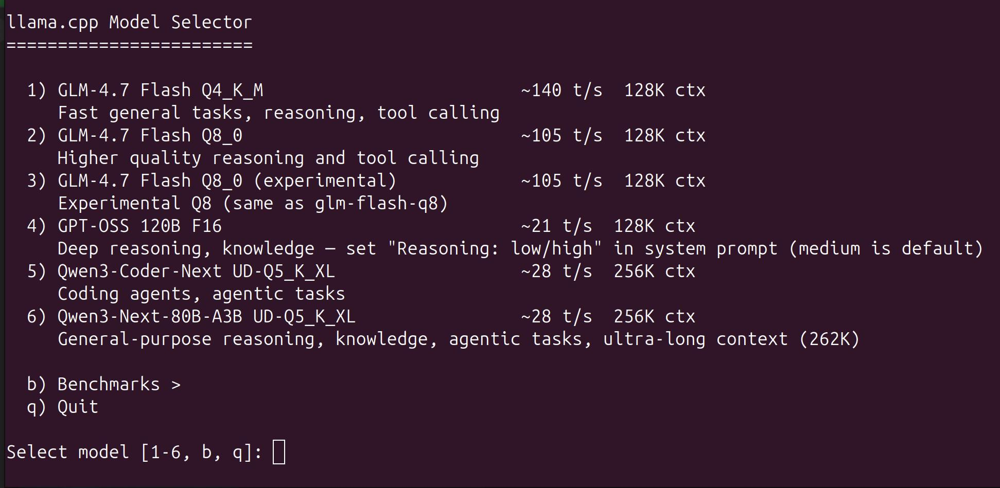
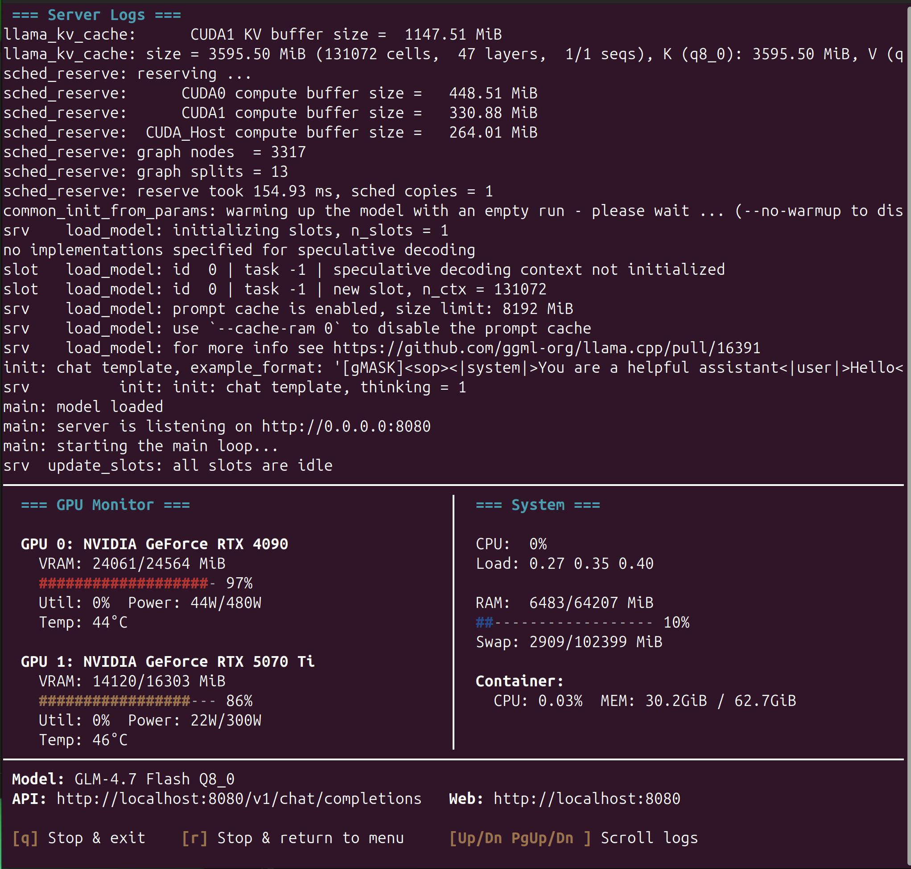
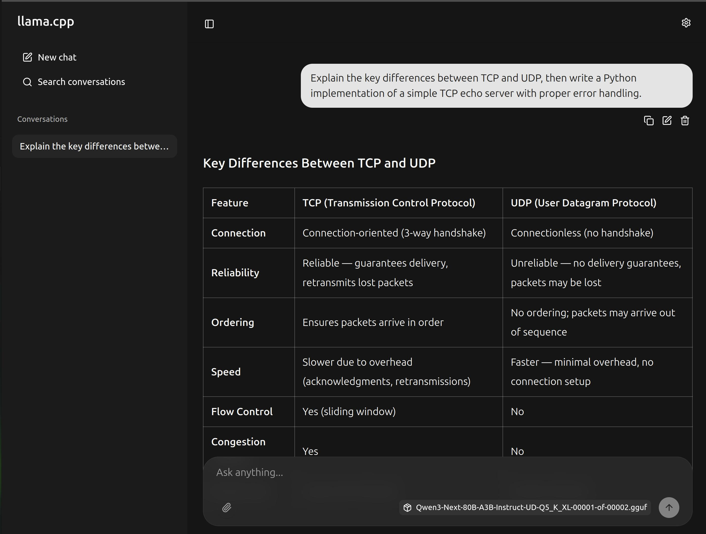

# Docker Wrapper for llama.cpp

Local LLM serving made manageable. A Docker wrapper around llama.cpp with model profiles, multi-GPU optimization, interactive monitoring dashboard, benchmarking pipeline, and Claude Code local integration — built for a dual-GPU desktop (RTX 4090 + RTX 5070 Ti) but adaptable to other setups.

## Table of Contents

- [What Does This Wrapper Add?](#what-does-this-wrapper-add)
- [Use Cases](#use-cases)
- [Hardware](#hardware)
- [Quick Start](#quick-start)
- [Claude Code Local Integration](#claude-code-local-integration)
- [Models](#models)
- [Benchmarks (EvalPlus HumanEval+)](#benchmarks-evalplus-humaneval)
- [Adding New Models](#adding-new-models)
- [Configuration](#configuration)
- [Architecture & Documentation](#architecture--documentation)
- [AI-Assisted Development](#ai-assisted-development)
- [Repository Structure](#repository-structure)
- [Updating llama.cpp](#updating-llamacpp)

---

## What Does This Wrapper Add?

[llama.cpp](https://github.com/ggml-org/llama.cpp) is a high-performance C/C++ inference engine for running LLMs locally using quantized GGUF models. It supports CPU and GPU inference (CUDA, Metal, Vulkan), can split model layers across multiple GPUs and CPU RAM, and is the engine that [Ollama](https://ollama.com/) is built on. It includes a web UI, an OpenAI-compatible API, and automatic multi-GPU placement via `--fit`.

What it does not have is a convenient way to manage multiple model configurations, switch between them, monitor hardware usage, or integrate with development tools like Claude Code. That is what this wrapper adds:

- **Dockerized build** — compiles llama.cpp from source with hardware-specific CUDA flags, making the setup reproducible and isolated
- **Model selector** (`start.sh`) — interactive menu to pick a model, each with its own optimized GPU layer split, sampler defaults, and context size stored in `models.conf`
- **Monitoring dashboard** (`dashboard.py`) — curses TUI showing server logs, per-GPU VRAM/utilization/temperature, and system stats; includes an in-dashboard model picker (`m` key) and a management API on port 8081 for switching models programmatically
- **Claude Code local integration** (`claude-local`) — run Claude Code against the local llama-server instead of the Anthropic cloud, with sandboxing and VS Code integration
- **Benchmarking** — EvalPlus HumanEval+ runner to compare local models against each other and against proprietary references
- **Model onboarding** — `/add-model` skill with agent-assisted workflow for evaluating, configuring, and benchmarking new models
- **Documentation** — GPU placement strategies, sampler settings per model, architecture overview, lessons learned

llama.cpp provides the inference engine, web UI, and API. Everything else listed above is part of this wrapper.

## Use Cases

| Use case | What this project offers |
|----------|------------------------|
| **Local LLM inference with multi-GPU** | Automatic tensor placement (`--fit`) across asymmetric GPUs, model profiles with per-model GPU/context/sampler tuning, monitoring dashboard |
| **Running Claude Code with local models** | `claude-local` connects Claude Code to the local llama-server — chat, tool use, thinking, VS Code integration, bubblewrap sandboxing, mid-session model switching |
| **Model benchmarking** | EvalPlus HumanEval+ pipeline for comparing local models against each other and proprietary references (Claude, GPT, etc.) |
| **MoE model optimization** | Working reference for how MoE vs dense architectures behave with automatic GPU placement across GPUs with different VRAM sizes |
| **Learning about Claude Code workflows** | The project itself is developed with Claude Code agents and skills — see [AI-Assisted Development](#ai-assisted-development) |

For a guide on setting up Claude Code itself (agents, skills, project workflows), see the separate [Claude Code Setup](https://github.com/nerdpudding/claude_code_setup) repository.

> **Note:** This is not a plug-and-play installer. The Docker build compiles llama.cpp for specific GPU architectures (sm_89 + sm_120), and all model configurations are tuned for specific hardware (RTX 4090 + RTX 5070 Ti). It can be adapted to other setups, but GPU layers and build flags will need adjusting. The detailed docs are there to help with that.

## Background

For local LLM inference I used Ollama for a long time and it does a great job: easy model management, clean API, simple GPU offloading via GGUF. But as my projects moved toward larger models, agentic flows, and tighter hardware optimization, I kept running into limits. I wanted precise per-layer GPU/CPU placement across two GPUs with different VRAM sizes, access to the latest llama.cpp features as soon as they land, and control over build flags targeting my specific GPU architectures. Ollama's goal is simplicity — which it does well — but that means it doesn't expose these lower-level controls and sometimes lags behind on newer llama.cpp features.

So I went back to llama.cpp directly. It has come a long way: web UI, OpenAI-compatible API, automatic multi-GPU placement via `--fit` (including MoE expert offloading). The goal of this wrapper is simple: get the most out of my hardware in terms of model quality, speed, and context length — and more recently, to use these local models as a backend for Claude Code. More on that in the [DGX Spark comparison article](docs/dgx-spark-comparison.md).

## Hardware

| Component | Spec |
|-----------|------|
| GPU 0 | NVIDIA RTX 4090 (24 GB VRAM) — Ada Lovelace, sm_89 |
| GPU 1 | NVIDIA RTX 5070 Ti (16 GB VRAM) — Blackwell, sm_120 |
| CPU | AMD Ryzen 7 5800X3D (8C/16T) |
| RAM | 64 GB DDR4 |
| OS | Ubuntu 24.04 |
| Driver | 580.x (open kernel) |
| CUDA | 13.0 (required for sm_120 / Blackwell support) |

Total GPU VRAM: 40 GB across two GPUs with asymmetric split.

## Quick Start

### Build & install

```bash
git clone <repo-url> llama_cpp
cd llama_cpp
git clone https://github.com/ggml-org/llama.cpp.git
```

Download models into `models/<model-dir>/`:

```bash
huggingface-cli download <repo> <file> --local-dir models/<model-dir>/
```

Build the Docker image:

```bash
docker compose build
```

**Requirements:** Docker with Compose v2, NVIDIA Container Toolkit, NVIDIA driver 580+ (open kernel recommended for Blackwell), sufficient disk space for models (60-200+ GB).

### Run a model

```bash
./start.sh                  # Interactive menu + monitoring dashboard
./start.sh glm-flash-q4     # Direct launch (stops running container first)
./start.sh --list           # List available models
./start.sh --no-dashboard   # Launch without dashboard (raw docker compose logs)
```

The script shows an interactive model selector with speeds and context sizes:



It generates `.env`, starts the container, waits for the server to be ready, and opens a monitoring dashboard with server logs, GPU stats, and system stats:



**Dashboard controls:**
- **`q`** — Stop the server and exit
- **`r`** — Stop the server and return to the model menu
- **`m`** — Open model picker (switch models without leaving the dashboard)
- **`Up/Down/PgUp/PgDn`** — Scroll server logs

**Access:**
- **Web UI:** http://localhost:8080 — llama.cpp's built-in chat interface
- **API:** http://localhost:8080/v1/chat/completions
- **Management API:** http://localhost:8081 — model switching for agents and external tools (`GET /models`, `GET /status`, `POST /switch`)



**Test with curl:**

```bash
curl http://localhost:8080/v1/chat/completions \
  -H "Content-Type: application/json" \
  -d '{"messages": [{"role": "user", "content": "Hello!"}], "max_tokens": 100}'
```

## Claude Code Local Integration

Since llama.cpp supports the [Anthropic Messages API](https://huggingface.co/blog/ggml-org/anthropic-messages-api-in-llamacpp) natively, this setup works as a local backend for [Claude Code](https://claude.com/claude-code). The `claude-local` command starts a separate Claude Code instance that connects to the local llama-server instead of the Anthropic cloud.

**What works:**
- Chat, tool use (Glob, Read, Write, Edit), thinking blocks
- VS Code IDE integration (diffs in editor)
- Bubblewrap sandboxing (bash commands restricted)
- Mid-session model switching via management API (conversation context preserved)
- Skills and agents (with local model capability limitations)

**What to be aware of:**
- Local models are less capable than Opus — review actions before approving
- The sandbox only covers bash commands, not Write/Edit tools
- Some Claude Code features (prompt caching, adaptive reasoning) do not work locally

**Setup:** See [`claude-local/README.md`](claude-local/README.md) for installation, configuration, usage, and safety guide.

**What's next:** Automatic model switching within claude-local (agent decides which local model fits the task) is a future goal. Integration with other tools (Continue.dev, aider, [OpenClaw](https://github.com/openclaw/openclaw)) is on the [Roadmap](ROADMAP.md) but not planned for the short term.

## Models

All models are MoE (Mixture of Experts) and defined in `models.conf`. Use the section ID with `./start.sh` to launch.

| Section ID | Model | Speed | Context | Best for |
|------------|-------|-------|---------|----------|
| `glm-flash-q4` | GLM-4.7 Flash Q4_K_M | ~147 t/s | 128K | Fast tasks, reasoning |
| `glm-flash-q8` | GLM-4.7 Flash Q8_0 | ~112 t/s | 128K | Quality reasoning, tools |
| `glm-flash-exp` | GLM-4.7 Flash Q8_0 (experimental) | ~112 t/s | 128K | Experimental |
| `gpt-oss-120b` | GPT-OSS 120B F16 | ~22 t/s | 128K | Deep reasoning, knowledge |
| `qwen3-coder-ud-q5` | Qwen3-Coder-Next UD-Q5_K_XL | ~33 t/s | 256K | Coding agents |
| `qwen3-next-ud-q5` | Qwen3-Next-80B-A3B UD-Q5_K_XL | ~33 t/s | 256K | General reasoning, ultra-long context |

### Sampler settings

Recommended client-side settings per model. Most clients override server defaults, so set these explicitly.

| Setting | GLM (general) | GLM (coding) | GPT-OSS | Qwen3-Coder | Qwen3-Next |
|---------|--------------|-------------|---------|-------------|------------|
| temperature | 1.0 | 0.7 | 1.0 | 1.0 | 0.7 |
| top_p | 0.95 | 1.0 | 1.0 | 0.95 | 0.8 |
| top_k | — | — | 0 (disabled) | 40 | 20 |
| min_p | 0.01 | 0.01 | — | 0.01 | — |

Full details and rationale: [docs/client-settings.md](docs/client-settings.md)

### Model-specific notes

**GPT-OSS 120B reasoning levels:** GPT-OSS supports configurable reasoning effort via a system prompt trigger (`"Reasoning: low/medium/high"`). This cannot be set server-side — set it in the system prompt field of your client. `medium` is the default when no system prompt is set. See the [model card](models/documentation/README_modelcard_gpt-oss-120b-GGUF.md) for details.

## Benchmarks (EvalPlus HumanEval+)

Coding benchmark: 164 Python problems (HumanEval+), pass@1, greedy decoding. HumanEval+ uses 80x more tests than standard HumanEval.

### Local results (2026-02-23)

| # | Model | HumanEval | HumanEval+ | vs published |
|---|-------|-----------|------------|--------------|
| 1 | Claude Opus 4.6 | 98.2% | 95.1% | +4.0pp |
| 2 | Claude Opus 4.6 (thinking) | 99.4% | 93.9% | +5.2pp |
| 3 | Qwen3-Next UD-Q5_K_XL | 98.2% | 93.9% | — |
| 4 | Qwen3-Coder-Next UD-Q5_K_XL | 93.9% | 90.9% | -0.2pp |
| 5 | Qwen3-Coder-Next UD-Q6_K_XL | 92.1% | 89.0% | — |
| 6 | GLM-4.7 Flash Q8_0 * | 89.0% | 87.2% | +2.0pp |
| 7 | GPT-OSS 120B F16 | 93.3% | 87.2% | +5.0pp |
| 8 | GLM-4.7 Flash Q4_K_M * | 87.8% | 83.5% | +0.8pp |

**"vs published"** = difference in HumanEval score compared to the closest published reference score for that model (from model cards, [EvalPlus leaderboard](https://evalplus.github.io/leaderboard.html), or benchmark articles). Not always an exact apples-to-apples comparison — see [REPORT.md](benchmarks/evalplus/results/REPORT.md) for full details, reference sources, and caveats.

\* Reasoning model — benchmarked with `--reasoning-format none` (thinking tokens included in output). Claude was benchmarked via Claude Code (Max subscription) using a custom agent with the same prompts and evaluation pipeline, instead of the llama.cpp API.

Full results with proprietary model comparisons: [benchmarks/evalplus/results/REPORT.md](benchmarks/evalplus/results/REPORT.md)

### Running benchmarks

```bash
cd benchmarks/evalplus
source .venv/bin/activate       # One-time setup: uv venv && uv pip install evalplus
./benchmark.sh bench-glm-flash-q4       # Smoke test (one model)
./benchmark.sh --local                  # All local models
./benchmark.sh --all                    # All models (local + Claude)
```

Full setup and usage: [benchmarks/evalplus/README.md](benchmarks/evalplus/README.md)

## Adding New Models

The `/add-model` skill provides a guided 8-phase workflow for evaluating and adding new GGUF models. **This is built for [Claude Code](https://claude.com/claude-code)** and uses its agents and skills system, but the workflow pattern (evaluate → configure → test → benchmark → document) could be adapted for other AI-assisted development tools.

1. **Evaluate** — Analyze architecture, quant options, VRAM fit (model-manager agent)
2. **Download** — User downloads files to `models/<dir>/`
3. **Create profile** — Add production profile to `models.conf` (gpu-optimizer agent)
4. **Find samplers** — Research official sampler settings (model-manager agent)
5. **Test** — Verify the model loads, generates, and performs well
6. **Create bench profile** — Add benchmark profile to `models.conf`
7. **Run benchmark** — EvalPlus HumanEval+ evaluation (benchmark agent)
8. **Update docs** — Update README, client-settings, ROADMAP (doc-keeper agent)

Usage: run `/add-model <model-name>` in Claude Code.

### Candidate models

Models being evaluated for potential addition. Model cards are in `models/documentation/CANDIDATES/`.

| Model | Params | Architecture | Specialty |
|-------|--------|-------------|-----------|
| Nemotron-3-Nano-30B-A3B | 30B / 3.5B active | Hybrid Mamba2-Transformer MoE | Reasoning, tool calling, math/coding (SWE-bench 38.8%) |
| Devstral-Small-2-24B | 24B dense | Dense Transformer | Agentic coding (SWE-bench 68.0%, Terminal Bench 22.5%), vision |
| Ministral-3-14B-Instruct | 14B | Dense + vision encoder | General-purpose, multilingual, edge-optimized |
| Ministral-3-14B-Reasoning | 14B | Dense + vision encoder | Math/STEM reasoning (AIME25 85.0%) |

## Configuration

| File | Purpose |
|------|---------|
| `models.conf` | Server config: model paths, context size, sampler defaults, `--fit` GPU placement |
| `docker-compose.yml` | Docker container config, GPU device mapping, volume mounts |
| `benchmarks/evalplus/bench-client.conf` | Benchmark client config: system prompts, reasoning levels per model |
| `.env` | Auto-generated by `start.sh` from `models.conf` — never edit manually |

Annotated template with full variable reference: [docker-compose.example.yml](docker-compose.example.yml)

## Architecture & Documentation

For a high-level overview of how all components connect (llama-server, dashboard, management API, Claude Code normal vs local, sandboxing), see **[docs/architecture.md](docs/architecture.md)**.

### Documentation index

| Document | Description |
|----------|-------------|
| [GPU Strategy Guide](docs/gpu-strategy-guide.md) | GPU placement decision tree, strategies A-D, graph splits, tuning guidance |
| [Client Settings](docs/client-settings.md) | Recommended temperature, top_p, top_k, min_p, and system prompt settings per model |
| [Bench Profile Test Results](docs/bench-test-results.md) | GPU optimization data: VRAM usage, speeds, OOM failures, layer split decisions |
| [EvalPlus Benchmark Results](benchmarks/evalplus/results/REPORT.md) | Latest HumanEval+ scores for all models vs proprietary references |
| [EvalPlus Benchmark Runner](benchmarks/evalplus/README.md) | HumanEval+ coding benchmark setup, usage, and comparison with proprietary models |
| [Claude Code Local Setup](claude-local/README.md) | Installation, usage, and safety guide for running Claude Code with a local backend |
| [Architecture Overview](docs/architecture.md) | C4-style overview of all components and design decisions |
| [DGX Spark Comparison](docs/dgx-spark-comparison.md) | DGX Spark vs desktop analysis for local LLM inference |
| [Lessons Learned](docs/lessons_learned.md) | Common mistakes and prevention rules |
| [Local Setup Decision](docs/decisions/2026-02-24_claude-code-local-setup.md) | Analysis of isolation options and rationale for the chosen approach |
| [docker-compose.example.yml](docker-compose.example.yml) | Annotated compose template with full variable reference |

## AI-Assisted Development

This project is developed with [Claude Code](https://claude.com/claude-code) using specialized agents and workflows.

| Resource | Purpose |
|----------|---------|
| `AI_INSTRUCTIONS.md` | Project context and rules for AI tools |
| `.claude/agents/` | Specialized agents (gpu-optimizer, benchmark, model-manager, builder, diagnose, api-integration, doc-keeper) |
| `.claude/skills/add-model/` | `/add-model` — 8-phase model onboarding workflow |
| `claude_plans/` | Active plan files (archived to `archive/` when done) |

**Workflow:** plan → approve → implement → test → document → commit. Non-trivial changes start as a plan file, get user approval, then are implemented with the appropriate agents.

See [ROADMAP.md](ROADMAP.md) for current status, completed milestones, and future plans.

**Research:** [DGX Spark vs Desktop Comparison](docs/dgx-spark-comparison.md) — analysis of when NVIDIA's DGX Spark (128 GB unified memory, Grace Blackwell) is worth it compared to a dual-GPU desktop for local inference. Key finding: Spark is 2.7x faster for GPT-OSS 120B (52.8 vs 19.7 t/s) but the desktop wins for models that fit on a single GPU.

## Repository Structure

```
.
├── README.md                      # This file
├── AI_INSTRUCTIONS.md             # Project context for AI tools
├── ROADMAP.md                     # Future plans and status
├── Dockerfile                     # Multi-stage build (CUDA 13.0, sm_89+sm_120)
├── docker-compose.yml             # Production compose file
├── docker-compose.example.yml     # Annotated template with usage instructions
├── .dockerignore
├── .gitignore
├── models.conf                    # Server configuration (all models)
├── start.sh                       # Model selector script (generates .env, launches dashboard)
├── dashboard.py                   # Terminal monitoring dashboard (curses TUI)
├── .env.example                   # Generic template with all variables documented
├── docs/
│   ├── gpu-strategy-guide.md              # GPU placement decision tree
│   ├── client-settings.md                 # Recommended client-side sampler settings per model
│   ├── bench-test-results.md              # Bench profile GPU optimization (VRAM, speeds, OOM tests)
│   ├── dgx-spark-comparison.md            # DGX Spark vs desktop comparison (draft article)
│   ├── lessons_learned.md                 # Mistakes and prevention rules
│   ├── claude_tips.md                     # Claude Code usage tips
│   ├── extended-benchmarks-research.md    # Research on non-coding benchmarks
│   ├── alternative_benches_advice.md      # Alternative benchmark options
│   ├── screenshots/                       # UI screenshots for README
│   ├── architecture.md                    # C4-style architecture overview
│   └── decisions/                         # Architecture/design decision records
├── claude-local/                  # Claude Code local instance setup
│   ├── README.md                  # Installation, usage, and safety guide
│   ├── install.sh                 # Copies config to ~/.claude-local/ and ~/bin/
│   ├── bin/claude-local           # Wrapper script
│   └── home/                      # Config files (CLAUDE.md, settings.json, skills)
├── models/                        # GGUF files (gitignored)
│   ├── .gitkeep
│   ├── documentation/             # Model cards (README from HuggingFace)
│   │   └── CANDIDATES/            # Model cards for potential future models
│   ├── GLM-4.7-Flash/
│   ├── GPT-OSS-120b/
│   ├── Qwen3-Coder-Next/
│   │   └── UD-Q5_K_XL/
│   └── Qwen3-Next/
│       └── UD-Q5_K_XL/
├── benchmarks/
│   └── evalplus/                  # EvalPlus HumanEval+ coding benchmark runner
│       ├── benchmark.sh           # Main runner (orchestrates all steps)
│       ├── bench-client.conf      # Client-side config (system prompts per model)
│       ├── generate-report.py     # Results → comparison table
│       ├── reference-scores.json  # Published proprietary model scores
│       └── results/               # Benchmark outputs (gitignored)
│           └── REPORT.md          # Latest EvalPlus HumanEval+ results
├── archive/                       # Archived plans and superseded docs (cleaned periodically)
├── claude_plans/                  # Claude Code plan files
├── llama.cpp/                     # llama.cpp source (separate git repo, gitignored)
└── .claude/
    ├── agents/                    # Claude Code specialized agents
    │   ├── gpu-optimizer.md
    │   ├── benchmark.md
    │   ├── builder.md
    │   ├── diagnose.md
    │   ├── model-manager.md
    │   ├── api-integration.md
    │   └── doc-keeper.md
    └── skills/                    # Claude Code skills (reusable workflows)
        └── add-model/SKILL.md    # /add-model — model onboarding workflow
```

## Updating llama.cpp

```bash
cd llama.cpp
git pull origin master
cd ..
docker compose build --no-cache
```

The `llama.cpp/` directory is a separate git repository — it's gitignored from this wrapper project and updated independently.
